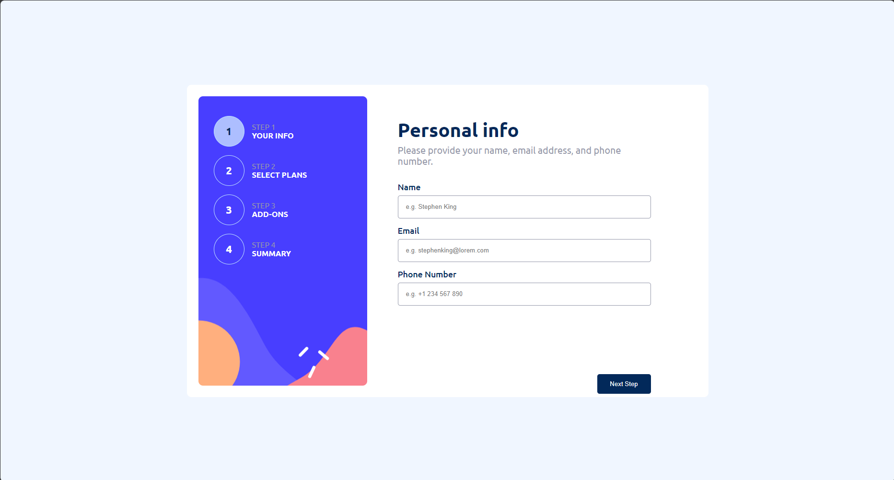

# Frontend Mentor - Multi-step form solution

This is a solution to the [Multi-step form challenge on Frontend Mentor](https://www.frontendmentor.io/challenges/multistep-form-YVAnSdqQBJ). Frontend Mentor challenges help you improve your coding skills by building realistic projects. 

## Table of contents

- [Overview](#overview)
  - [The challenge](#the-challenge)
  - [Screenshot](#screenshot)
  - [Links](#links)
- [My process](#my-process)
  - [Built with](#built-with)
- [Author](#author)
- [Acknowledgments](#acknowledgments)

## Overview

### The challenge

Users should be able to:

- Complete each step of the sequence
- Go back to a previous step to update their selections
- See a summary of their selections on the final step and confirm their order
- View the optimal layout for the interface depending on their device's screen size
- See hover and focus states for all interactive elements on the page
- Receive form validation messages if:
  - A field has been missed
  - The email address is not formatted correctly
  - A step is submitted, but no selection has been made

### Screenshot

### Links

- Solution URL: [Github](https://github.com/DavidAdjei/multiStepForm)
- Live Site URL: [Varcel App](https://multi-step-form-nine-kappa.vercel.app/)

## My process

### Built with

- Semantic HTML5 markup
- CSS custom properties
- Flexbox
- CSS Grid
- Mobile-first workflow
- [React](https://reactjs.org/) - JS library

## Author

- Frontend Mentor - [@DavidAdjei](https://www.frontendmentor.io/profile/DavidAdjei)
- Twitter - [@nharnahadjei2](https://twitter.com/nharnahadjei2)
- LinkedIn - [@David Adjei](https://www.linkedin.com/in/david-adjei-313a811a2/)

## Acknowledgments

- LinkedIn - [@Raymond Adjei](https://www.linkedin.com/in/raymond-adutwum-agyei-366929117/)

